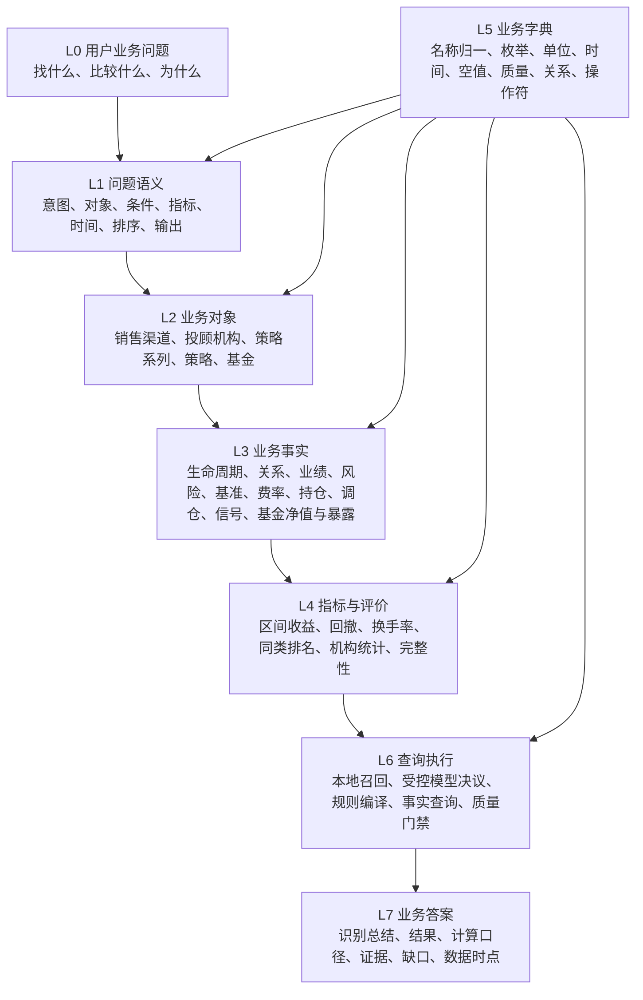
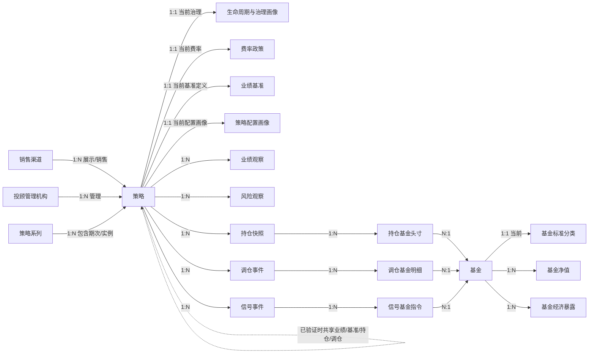
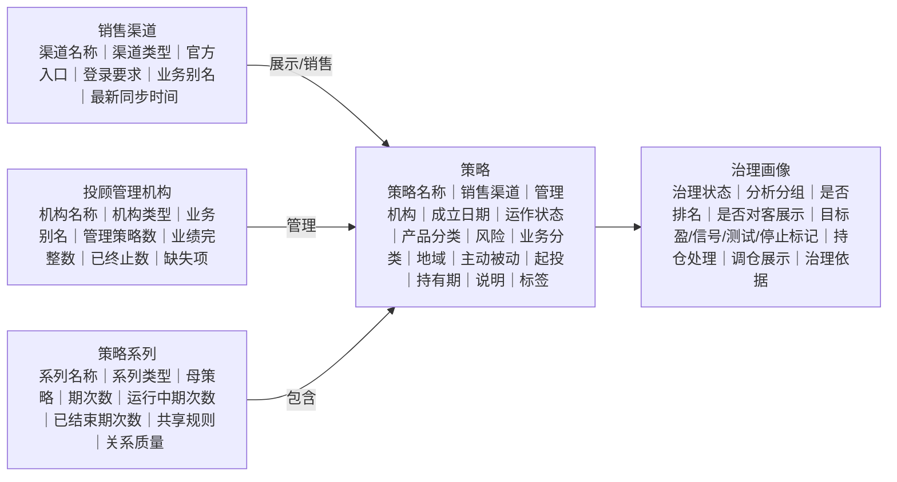
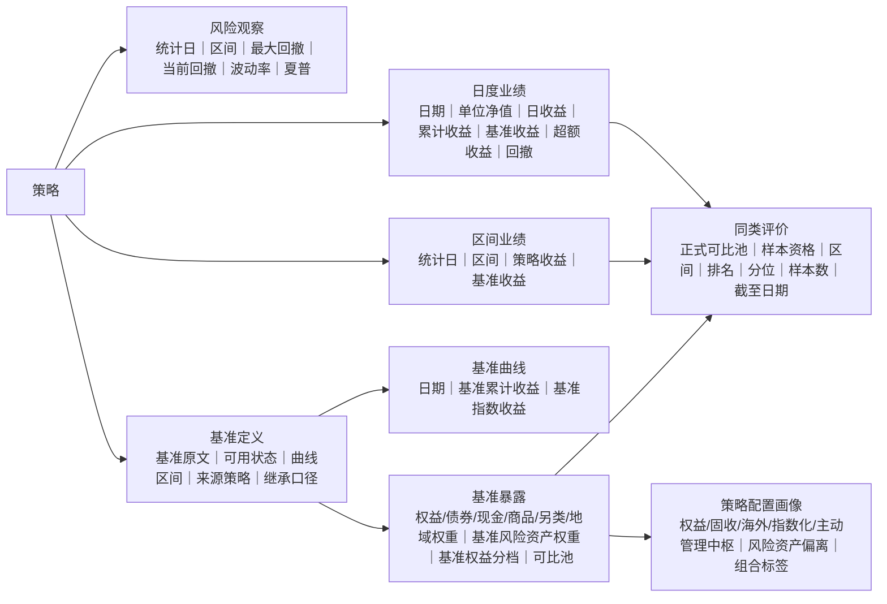
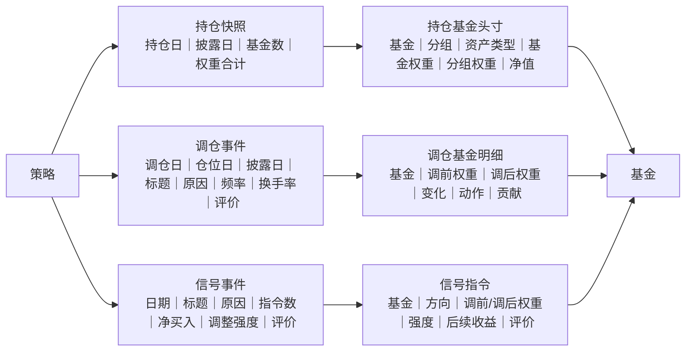
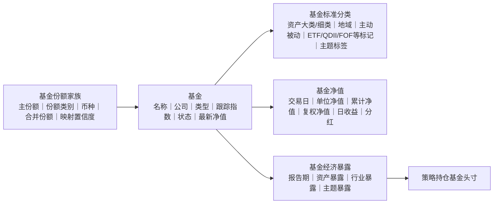
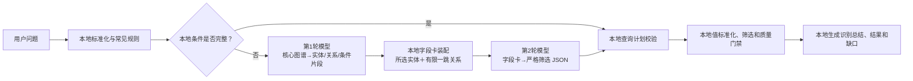

# AI 选策略业务实体结构图与问答字典

> 版本：业务优先设计 v5（active）  
> 口径更新：2026-08-08。业务图谱只保留可解释、可筛选、可比较的业务属性，不再以页面物理字段总数作为设计目标。  
> 适用范围：AI 选策略、策略列表、策略详情、机构统计、业绩/基准/持仓/调仓/基金穿透问答。  
> 核心约束：用户按业务名称提问，不要求也不返回统一策略 ID、渠道策略 ID、事件 ID、快照 ID、文件路径等技术字段。

## 1. 先给结论

实体模型应从“用户在问哪个业务对象、哪类事实、哪个时间范围”出发，而不是从页面物理字段出发。

本设计采用以下原则：

1. **策略、机构、渠道、基金是业务对象**；业绩、风险、持仓、调仓、基准是附着在对象上的业务事实。
2. **页面宽表只是查询加速投影**，不是业务本体；页面缺字段时可以回到底层事实查询。
3. **技术键只负责内部连接**。模型不能创造技术 ID，用户答案默认不显示技术 ID。
4. **常见问题零模型调用**。本地规则已经完整识别时直接执行，不为调用模型而调用模型。
5. **需要模型时固定为两轮**。第一轮只识别业务实体、关系和条件片段；第二轮只读取相关实体字段卡并生成筛选计划，不按子句追加调用。
6. **模型只做语义路由和计划选择**。日期、比例、收益、回撤、权重、换手率、排名和 SQL 均由本地程序确定性计算。
7. **空值不是“不满足”**。必须区分未披露、未采集、不适用、尚未形成、解析失败和治理留空。
8. **所有答案带数据时点和质量说明**，不能把数据缺口解释为业务事实为否。

## 2. 完整分层结构

| 分层 | 解决的问题 | 主要内容 | 是否允许模型自由生成 |
| --- | --- | --- | --- |
| L0 用户问题 | 用户在业务上想知道什么 | 原始问题、上下文 | 否，仅作为输入 |
| L1 问题语义 | 问谁、看什么、什么条件 | 意图、目标对象、指标、条件、时间、分组、排序、结果形式 | 仅复杂歧义时受约束选择，通常不超过两次 |
| L2 业务对象 | 被讨论的业务主体是谁 | 渠道、机构、策略系列、策略、基金 | 否，必须命中字典或当前数据 |
| L3 业务事实 | 对象发生了什么 | 观察、快照、头寸、事件、政策、分类、关系 | 否，来自数据库事实 |
| L4 指标评价 | 如何计算与比较 | 收益、风险、换手、同类池、排名、机构汇总、数据完整性 | 否，程序计算 |
| L5 业务字典 | 名称和口径怎样统一 | 别名、枚举、单位、空值、时间、关系、质量、算子 | 否，版本化配置 |
| L6 查询执行 | 如何稳定、低成本执行 | 本地召回、规则编译、参数化查询、缓存、质量门禁 | 只有歧义决议可调用模型 |
| L7 业务答案 | 怎样让用户看懂 | 已识别条件、结果、依据、缺口、时点 | 默认模板生成；深度解读可另选模型 |

## 3. 业务对象与核心关系总图

## 4. 用户问题语义对象

这些对象用于把自然语言连接到业务实体，不要求用户说任何 ID。

| 语义对象 | 完整字段 | 业务说明 |
| --- | --- | --- |
| 用户问题 | 原始问题、会话业务上下文、查询基准时间 | 保留用户原话；上下文只保留上一轮明确的机构、策略、时间和比较对象 |
| 业务意图 | 查找策略、比较策略、查看策略详情、机构概览、业绩查询、风险查询、基准查询、持仓查询、调仓查询、基金查询、排名查询、数据质量查询、口径说明 | 一个问题可含一个主意图和多个辅助意图 |
| 目标对象 | 对象类型、业务名称、标准名称、别名命中、对象范围、识别置信度 | 对象类型只能从业务实体字典选择；标准名称必须来自当前数据或别名字典 |
| 筛选条件 | 业务概念、比较关系、原始值、标准值、单位、时间范围、肯定/否定、空值处理、适用对象 | 页面显示业务说明，例如“回撤不超过 3%”，不显示字段名 |
| 指标要求 | 指标名称、计算口径、观察窗口、是否看基准、是否看超额、是否需要排名 | 指标值只能由本地事实与公式计算 |
| 结果要求 | 分组、排序、数量、明细/汇总、比较对象、解释深度 | 如“按投顾机构统计”“按近三月收益降序”“给前 20 个” |
| 查询计划 | 主业务对象、关系路径、事实粒度、时间锚点、聚合规则、质量门禁、执行绑定 | 系统内部对象；不直接展示技术查询语句 |
| 业务答案 | 已识别总结、主要结果、计算口径、数据时点、数据缺口、证据摘要、可继续追问项 | 默认由模板生成，保证可解释和低成本 |

## 5. 完整业务实体字段

### 5.1 机构、系列、策略与治理

| 业务实体 | 粒度 | 完整业务字段 | 主要事实来源 | 可回答的问题 |
| --- | --- | --- | --- | --- |
| 销售渠道 | 每个业务渠道一条 | 渠道名称、渠道类型、官方入口、登录要求、业务别名、是否参与当前发布、最新采集时间、最新有效数据时间、策略总数、业绩完整数、已终止数、业绩缺失数 | 渠道信息、策略信息、数据来源清单 | “天天基金有哪些策略”“广发证券数据完整度怎样” |
| 投顾管理机构 | 每个标准机构一条 | 标准机构名称、机构类型、业务别名、管理策略总数、业绩完整数、数据完整数、无基准数、无仓位数、已终止数、业绩缺失数、最新业绩时间、最新持仓时间 | 策略信息及机构汇总 | “广发基金管理多少策略”“哪个机构完整策略最多” |
| 策略系列 | 每个系列一条 | 系列名称、系列类型、母策略名称、品牌/机制、期次数、运行中期次数、已结束期次数、最早成立日期、最新成立日期、业绩共享规则、基准共享规则、持仓共享规则、调仓共享规则、关系状态、关系证据 | 策略关系、策略治理标签；当前由关系事实聚合 | “幸福小心愿目标盈有多少期”“各期是否共用母策略业绩” |
| 策略 | 每个策略一条 | 策略名称、销售渠道、投顾管理机构、渠道披露产品类型、披露风险等级、成立日期、建议持有时长、起投金额、策略说明、标签、当前运作状态、对客展示状态、研报产品类型、研报股票子类型、业务分类、业务组合分类、市场地域、主动被动、风险等级、特殊标签、策略实现标签 | 策略信息、策略治理标签、页面业务分类加工 | “找成立超过一年、R2、固收增强的策略” |
| 策略关系 | 每个已验证关系一条 | 子策略名称、母策略名称、关系类型、官方业绩来源策略名称、基准来源策略名称、持仓来源策略名称、调仓来源策略名称、继承口径、关系状态、置信度、证据、规则版本、首次识别时间、最近复核时间、连续不一致次数 | 策略关系 | “子策略为什么没有独立曲线”“它继承了母策略哪些数据” |
| 生命周期与治理画像 | 每个策略当前一条 | 治理状态、分析分组、是否测试组合、是否信号类、是否目标盈期次、是否已停止、是否清盘、是否业绩停更、是否缺官方业绩、是否业绩异常、是否历史接口留档、是否纳入常规排名、是否单独分析、仅列表展示、业绩分析截止日期、官方最新业绩日期、业绩停更天数、持仓处理方式、调仓展示方式、治理规则、治理证据 | 策略治理标签 | “哪些策略已下架但仍可查”“为什么不参与排名” |
| 费率政策 | 每个策略当前一条 | 投顾费率原文、年化投顾费率、费率状态、费率来源、适用区间、是否可用于费率比较、建议补采动作、最近更新时间 | 策略基准费率状态 | “投顾费率低于 0.5% 的策略” |

### 5.2 业绩、基准、风险与排名

| 业务实体 | 粒度 | 完整业务字段 | 主要事实来源 | 可回答的问题 |
| --- | --- | --- | --- | --- |
| 业绩基准定义 | 每个策略当前一条 | 业绩基准原文、标准基准说明、基准可用状态、基准曲线起止日、来源策略名称、继承口径、基准公式 | 策略基准费率状态、策略关系 | “基准是什么”“基准说明是什么” |
| 基准曲线点 | 每策略每交易日一条 | 交易日期、基准累计收益率、基准指数收益率、基准点位或归一净值 | 策略日度业绩、策略产品披露净值、指数日度行情 | “展示策略与基准的真实走势图” |
| 基准资产暴露快照 | 每策略当前基准一条 | 权益、债券、现金、商品、另类、A 股、港股和海外权益权重，基准风险资产权重、基准权益分档、非权益比较轨道、正式可比池 | 策略基准资产配置 | “基准权益分档 L2 的策略”“同类池是什么” |
| 策略配置画像 | 每策略当前一条 | 权益中枢、固收中枢、基准风险资产中枢、海外配置中枢、指数化程度、主动管理程度、风险资产偏离、资产集中度、持仓分散度、调仓活跃度、回撤韧性、超额收益能力、运作成熟度、配置风格标签 | 当前持仓、基准资产配置、业绩、风险和调仓的确定性组合计算 | “找低权益中枢、低回撤且正超额的策略” |
| 日度业绩观察 | 每策略每交易日一条 | 交易日期、单位净值、日收益率、累计收益率、基准收益率、超额收益、最大回撤 | 策略日度业绩、策略产品披露净值、策略标准业绩净值 | “7 月 28 日收益是多少”“画累计收益曲线” |
| 区间业绩观察 | 每策略每统计日每区间一条 | 统计日期、区间名称、策略收益率、基准收益率、超额收益、区间起始日、区间结束日 | 策略区间业绩；必要时由日度曲线重算 | “近三月收益大于 5%”“今年以来跑赢基准多少” |
| 标准回放业绩 | 每策略每交易日一条 | 标准费后净值、标准费前净值、费后/费前累计收益、费后/费前日收益、当日投顾费、累计投顾费、调仓日期 | 策略标准业绩净值、策略模拟净值 | “扣费前后差多少”“自建净值与官方偏差” |
| 风险观察 | 每策略每统计日每区间一条 | 统计日期、区间、区间收益、最大回撤、当前回撤、年化波动率、夏普比率、风险触发指标 | 策略披露风险指标、策略日度业绩、策略模拟净值质量 | “最大回撤小于 3%”“波动最低的策略” |
| 同类池与排名 | 每策略每区间一条 | 研报产品类型、股票子类型、市场地域、主动被动、基准权益分档、非权益比较轨道、正式可比池、样本资格、排名区间、收益排名、回撤排名、综合排名、百分位、样本数量、统计截止日期、排名资格、排除原因 | 基准分类、策略治理、业绩事实的确定性聚合 | “同类前 10%”“为什么该策略不排名” |

### 5.3 持仓、调仓与信号

| 业务实体 | 粒度 | 完整业务字段 | 主要事实来源 | 可回答的问题 |
| --- | --- | --- | --- | --- |
| 持仓快照 | 每策略每持仓日一条 | 持仓日期、披露日期、分组数量、基金数量、基金权重合计、现金权重、分组权重合计 | 策略当前持仓、策略当前持仓分组 | “最新持仓是哪天”“当前持仓有几只基金” |
| 持仓基金头寸 | 每策略每持仓日每基金一条 | 基金名称、基金代码（业务追溯）、资产类型、分组名称、基金权重、分组权重、基金净值、净值日期、最新日涨幅、操作标记、经济资产分类、行业暴露、主题暴露 | 策略当前持仓及基金维表 | “持有哪些债券基金”“AI 主题暴露是多少” |
| 调仓事件 | 每个调仓事件一条 | 所属策略、调仓日期、上次/本次仓位日期、标题、原因、调仓明细数、调前/调后权重合计、单次换手率、下次调仓日期、调仓超额、胜负、结果评价 | 策略调仓事件、调仓质量事件分析 | “最近一次为什么调仓”“过去一年调了几次” |
| 调仓基金明细 | 每调仓事件每基金一条 | 基金名称、分组、调前权重、调后权重、权重变化、调仓动作、分组调前/调后权重、基金区间收益、调前/调后贡献、贡献变化、收益起止日 | 策略调仓明细、调仓质量基金明细 | “卖出 A 买入 B 的权重变化”“哪只基金贡献最大” |
| 信号事件 | 每个信号事件一条 | 所属策略、信号日期、信号时间、标题、原因、指令总数、买入数、卖出数、加仓数、减仓数、净买入权重、总调整强度、1/3/6/12 月可评价指令数、胜率、加权方向收益、评价结论 | 信号策略事件 | “超级定投家最近发了什么信号” |
| 信号基金指令 | 每信号事件每基金一条 | 基金名称、分组、资产类型、指令方向、调前权重、调后权重、权重变化、指令强度、1/3/6/12 月基金收益、方向收益、评价、收益起止日期 | 信号策略基金指令 | “买入信号后 3 个月表现如何” |

### 5.4 基金、分类、净值与经济暴露

| 业务实体 | 粒度 | 完整业务字段 | 主要事实来源 | 可回答的问题 |
| --- | --- | --- | --- | --- |
| 基金 | 每基金一条 | 基金名称、基金代码（业务追溯）、基金公司、基金类型、跟踪指数、主题标签、基金状态、最新单位净值、最新累计净值、最新净值日期、最新日收益 | 基金信息、基金净值概况 | “策略持有的基金属于哪个公司”“基金最新净值” |
| 基金份额家族 | 每基金份额一条 | 基金家族、主份额名称、主份额代码、当前份额名称、当前份额代码、份额类别、计价币种、是否主份额、合并份额、映射来源、映射置信度、主份额选择规则 | 基金主份额映射 | “A/C 份额是否重复”“收益计算用哪个份额” |
| 基金标准分类 | 每基金当前一条 | 标准基金名称、其他名称、基金公司、基金经理、天天基金细分类/大类/二级分类、标准资产大类、标准资产细类、市场地域、主动被动、投顾资产分类桶、跟踪指数、主题标签、货币/债券/权益/混合/指数/ETF/ETF 联接/指数增强/QDII/FOF/LOF/REITs/商品黄金/短债/纯债/可转债标记、分类来源、置信度、最近更新时间 | 基金标准分类字典 | “找持有海外指数基金的策略” |
| 基金净值点 | 每基金每交易日一条 | 交易日期、单位净值、累计净值、复权净值、日收益率、每万份收益、七日年化、是否货币基金、分红送配 | 基金日度净值、基金分红送配 | “用真实复权净值回放调仓后收益” |
| 基金经济暴露快照 | 每基金每报告期一条 | 报告期、标准资产大类、标准资产细类、经济资产暴露、经济行业暴露、主题暴露、原始资产暴露、当前持仓权重、当前持仓策略数 | 基金经济暴露快照、季度资产/行业/股票/债券持仓 | “策略的行业和主题穿透暴露是多少” |

### 5.5 机构经营汇总

| 业务实体 | 粒度 | 完整业务字段 | 计算逻辑 | 可回答的问题 |
| --- | --- | --- | --- | --- |
| 机构经营统计 | 每渠道或每管理机构一条 | 机构名称、统计维度、策略总数、业绩完整总数、其中数据完整数、无基准数、无仓位数、已终止数、业绩缺失数、最新数据时间、统计时间 | 从策略、治理、业绩、基准、持仓按业务机构归一后汇总 | “哪个机构数据最完整”“广发基金缺哪些数据” |

## 6. 完整关系字典

| 关系 | 基数 | 业务含义 | 生效规则 | 用户可见表达 |
| --- | --- | --- | --- | --- |
| 销售渠道 → 策略 | 1:N | 某渠道销售、展示或披露策略 | 按业务渠道归一，不按采集程序名拆渠道 | “在天天基金展示” |
| 投顾管理机构 → 策略 | 1:N | 某机构管理或提供策略服务 | 使用标准机构名和别名字典 | “由广发基金管理” |
| 策略系列 → 策略 | 1:N | 一个品牌/机制下有多期或多实例产品 | 需名称、产品类型、说明书或官方关系证据 | “幸福小心愿目标盈第 19 期属于该系列” |
| 策略 → 策略 | 1:N/N:1 | 母子、期次或数据复用关系 | 不得只凭“第 X 期”自动继承；关系状态为有效才使用 | “该期共享母策略官方业绩” |
| 策略 → 治理画像 | 1:1 当前 | 当前生命周期、展示、排名和处理规则 | 由治理规则生成并保留证据 | “已终止，可查询但不排名” |
| 策略 → 费率政策 | 1:1 当前 | 当前披露费率及结构化值 | 以标准费率状态表为准 | “年化投顾费率 0.5%” |
| 策略 → 业绩基准 | 1:1 当前 | 策略的当前有效比较基准 | 自身披露优先；共享需已验证关系 | “基准为 20% 沪深 300 + 80% 中债指数” |
| 策略 → 业绩/风险 | 1:N | 按日期或区间观察的收益和风险 | 必须保留日期、区间、口径和来源 | “近三月收益”“今年以来最大回撤” |
| 策略 → 持仓快照 | 1:N | 不同持仓日的组合截面 | 直接披露和推算必须分开标记 | “截至 7 月 28 日持仓” |
| 持仓快照 → 基金头寸 | 1:N | 快照中的基金及权重 | 权重为空不得猜测；合计需稽核 | “持有某基金 12%” |
| 策略 → 调仓事件 | 1:N | 策略发生的官方或推断调仓 | 官方事件优先；推断事件单独标记 | “最近一次调仓” |
| 调仓事件 → 基金变化 | 1:N | 调仓中每只基金的前后权重变化 | 事件内按基金业务键去重 | “卖出 A、买入 B” |
| 策略 → 信号事件 | 1:N | 信号服务发出的组合级事件 | 不把候选清单当真实持仓 | “发出买入信号” |
| 基金 → 分类 | 1:1 当前 | 基金当前标准业务分类 | 标准分类字典优先 | “海外指数基金” |
| 基金 → 净值/暴露 | 1:N | 按交易日和报告期变化的事实 | 保留复权、报告期和质量口径 | “基金真实走势”“行业暴露” |
| 同类池 ↔ 策略 | N:M | 策略在不同评价区间进入相应可比池 | 需满足治理、基准、业绩和样本资格 | “在同类 100 只中排第 8” |
| 质量证据 → 任一实体/事实 | N:1 | 说明来源、缺口、冲突和可信度 | 质量状态不能覆盖原始业务事实 | “该值来自官方曲线，缺 2 个交易日” |

## 7. 业务值字典

### 7.1 名称归一字典

| 业务对象 | 标准值 | 当前别名/来源值 | 规则 |
| --- | --- | --- | --- |
| 销售渠道 | 广发证券 | 广发证券易淘金/财富管家、广发证券易淘金/贝塔牛理财、易淘金、贝塔牛理财，以及对应采集源 | 页面、统计和问答统一称“广发证券” |
| 销售渠道 | 广发基金 | 广发基金、广发基金-广发投顾、广发基金投顾、广发基金有限公司、广发基金管理有限公司 | 页面、统计和问答统一称“广发基金” |
| 销售渠道 | 天天基金/投顾 | 天天基金、天天投顾等业务别名 | 统一称“天天基金/投顾” |
| 投顾管理机构 | 广发基金 | 广发基金-广发投顾、广发基金投顾、广发基金有限公司、广发基金管理有限公司 | 管理机构汇总统一到“广发基金” |
| 策略、基金、机构动态名称 | 当前库中的标准名称 | 简称、全称、历史名、A/C 份额名、拼音缩写 | 每次发布离线生成别名索引，不写死在模型提示词 |

### 7.2 策略分类字典

| 字典 | 标准值 | 业务定义 |
| --- | --- | --- |
| 研报产品类型 | 纯债型、固收+型、股债混合型、股票型、多元配置型、持仓缺失/不入池 | 面向投研比较的主分类；股票型可继续用股票子类型细分 |
| 研报股票子类型 | 主动优选、指数驱动、行业主题型、行业轮动、QDII 型 | 只适用于研报产品类型为股票型的策略 |
| 业务分类 | 现金管理型、纯债/短债型、固收增强型、偏股配置型、多资产配置型、海外/全球型、主题/行业型、目标日期/养老型、目标盈系列产品、信号类策略 | 运营货架口径，可比研报产品类型更细 |
| 业务组合分类 | 风险等级｜业务分类 | 两个既有字典的组合结果，不是新的独立分类。例如“R2 稳健收益｜固收增强型” |
| 市场地域 | 国内、国内+海外、海外/全球 | 按 QDII/海外持仓、海外基准和强名称证据归类 |
| 主动被动 | 主动为主、指数/被动为主、主动被动混合、未稳定识别 | 按实际持仓基金类型聚合，不只看策略名称 |
| 运作状态 | 正常运作、公开披露、已终止、未披露 | 业务生命周期状态；已终止仍可查询，但默认不排名 |
| 对客展示 | 是、否 | 当前是否进入对客货架；与“曾经披露过”不同 |

### 7.3 风险字典

系统风险等级分别按权益权重、年化波动率、最大回撤落档，最终取三项中风险最高的一档：

| 风险档 | 权益基金权重 | 年化波动率 | 最大回撤 | 业务解释 |
| --- | ---: | ---: | ---: | --- |
| R0 现金/超低波 | ≤3% | ≤0.8% | ≤1.2% | 现金管理或极低波动 |
| R1 低波 | ≤8% | ≤2.0% | ≤3.0% | 低波稳健 |
| R2 稳健收益 | ≤18% | ≤4.0% | ≤6.0% | 稳健收益 |
| R3 均衡稳健 | ≤35% | ≤7.5% | ≤12.0% | 股债均衡偏稳健 |
| R4 均衡成长 | ≤55% | ≤11.0% | ≤20.0% | 均衡成长 |
| R5 权益/进取 | 高于 R4 任一上限 | 高于 R4 任一上限 | 高于 R4 任一上限 | 权益或进取型 |
| D0 持仓缺失 | 无法计算 | 无法计算 | 无法计算 | 权重缺失，不进入正式风险同档比较 |

注意：`披露风险等级` 是渠道原始披露；`风险等级` 是系统统一测算。用户说“渠道披露的风险”时才使用前者，普通“风险等级”默认使用系统统一风险档。

### 7.4 基准、完整性和质量字典

| 字典 | 标准值 | 业务定义 |
| --- | --- | --- |
| 基准权益分档 | L0—L10 | 唯一首层分档。按业绩基准中的权益+商品+另类风险资产合计权重计算；L0=0%，L1=(0%,10%]，之后每 10 个百分点一档，L10=(90%,100%]。未知权重未消解时不得硬分档 |
| 权益中枢 | 0%—100% | 权益基金权重 + 50%×混合基金权重；用于组合筛选，不代替精确穿透股票仓位 |
| 固收中枢 | 0%—100% | 债券基金权重 + 货币基金权重 + 50%×混合基金权重 |
| 基准风险资产中枢 | 0%—100% | 等于基准风险资产权重，是基准权益分档的连续数值基础 |
| 海外配置中枢 | 0%—100% | 当前 QDII/海外基金权重与基准海外权益权重取较大值 |
| 指数化程度 | 0%—100% | 指数基金、ETF 和联接基金权重合计 |
| 主动管理程度 | 0%—100% | 主动基金权重合计 |
| 风险资产偏离 | -100—100 个百分点 | 权益中枢 - 基准风险资产中枢；正值表示当前组合风险资产高于基准 |
| 基准可用状态 | 文本+曲线、仅曲线、仅文本、仅区间、缺失 | 综合判断基准说明和基准收益序列是否可用 |
| 基准结构类型 | 纯权益、权益+债券主导、权益+货币主导、权益+商品主导、债券主导、货币主导、商品主导、多资产型、未知 | 按已解析基准资产权重归类 |
| 非权益比较轨道 | 债券主导、货币主导、多资产、商品主导、纯权益、未纳入 | 在权益分档之外约束非权益策略的比较对象 |
| 基础数据等级 | A、B、C | A=费率可解析且有基准文本或曲线；B=费率或基准至少一项可用；C=两者均不可用 |
| 费率状态 | 已披露可解析、缺失 | 是否能把披露费率结构化成年化百分比 |
| 业绩完整 | 是、否 | 最新业绩日期距当前最新数据日期不超过 5 天，且有足够点位绘制连续曲线；已终止策略单独统计 |
| 数据完整 | 是、否 | 在业绩完整基础上，基准和历史仓位也满足当前业务要求 |
| 数据完整性 | 完整、不完整、数据不全 | 页面宽表的综合质量标签；问答中应进一步拆成缺业绩、缺基准、缺仓位等具体原因 |
| 质量状态 | 已核验、有限可用、稀疏、缺失、冲突、不适用、衍生未核验 | 控制是否执行筛选、是否披露限制以及是否阻止结论 |

### 7.5 空值字典

| 空值代码 | 业务含义 | 筛选与回答行为 |
| --- | --- | --- |
| 未披露 | 源渠道没有披露该事实 | 不当作“不满足”；说明渠道未披露 |
| 未采集 | 应有数据但本次采集未成功 | 标记数据缺口和影响范围 |
| 不适用 | 该字段对当前策略类型无意义 | 从有效分母排除 |
| 尚未形成 | 因成立时间短、窗口未满或事件未发生而不可得 | 说明时间原因，不与采集失败合并 |
| 解析失败 | 原始值存在，但无法可靠标准化 | 不执行结构化硬筛选，保留原文供复核 |
| 治理留空 | 规则明确要求不生成该值 | 返回治理原因，不补猜 |

### 7.6 操作符与时间字典

| 数据类型 | 用户表达 | 标准操作 | 规则 |
| --- | --- | --- | --- |
| 文本/业务实体 | 是、为、包含、不包含、属于 | 等于、不等于、包含、不包含、属于集合 | 先做业务别名归一，再精确匹配 |
| 枚举 | R2、国内、固收增强 | 等于、不等于、属于集合 | 只能使用字典已有值，模型不得创造枚举 |
| 百分比 | 大于 5%、不超过 3%、2%—5% | 大于、大于等于、小于、小于等于、区间 | 页面统一按百分点存储；5% 标准化为数值 5 |
| 数量 | 至少 10 只、调仓超过 3 次 | 等于、比较、区间 | 中文数量词转整数 |
| 日期 | 今年、近 3 个月、成立超过 1 年、截至 7 月 28 日 | 日期边界、滚动窗口、日历区间 | 由本地日历程序根据查询基准日计算 |
| 布尔 | 有基准、无仓位、已终止、不排名 | 是、否 | 必须区分“否”和“缺失” |
| 排序 | 收益最高、回撤最小、最近调仓 | 升序、降序 | 空值默认置后，并披露空值数量 |

## 8. 业务属性目录

业务图谱不再等同于物理字段清单。内部主键、文件路径、采集来源、可绘图标记、日期推断标记、载荷类型、访问级别、置信度和稽核状态仍保留在系统实现与审计层，但不进入普通业务问答。

| 业务实体 | 核心业务属性 |
| --- | --- |
| 策略 | 策略名称、渠道、投顾机构、成立日期、运作状态、对客展示、基准权益分档、研报产品类型、业务分类、市场地域、主动被动、风险等级 |
| 策略配置画像 | 权益中枢、固收中枢、基准风险资产中枢、海外配置中枢、指数化程度、主动管理程度、风险资产偏离、资产集中度、持仓分散度、调仓活跃度、回撤韧性、超额收益能力、运作成熟度、配置风格标签 |
| 业绩与风险 | 最新业绩日期、近一周/一月/三月/六月/一年收益、今年以来、累计收益、年化收益、最大回撤、当前回撤、波动率、夏普比率、基准收益、超额收益 |
| 基准与同类池 | 业绩基准说明、基准曲线、基准风险资产权重、基准权益分档、非权益比较轨道、正式可比池、排名资格 |
| 持仓与调仓 | 最新持仓日、基金数量、基金权重、资产/行业/主题暴露、最近调仓日、调仓次数、换手率、调前/调后权重、调仓原因、调仓贡献 |
| 机构经营统计 | 策略总数、业绩完整、数据完整、无基准、无仓位、已终止、业绩缺失、最新数据时间 |

推荐的组合查询不是再创造大量固定标签，而是对连续属性做确定性组合，例如：

- 稳健配置候选：`权益中枢 < 20% AND 最大回撤 < 3% AND 近1年超额收益 > 0`；
- 低风险偏主动：`基准权益分档 IN (L1,L2,L3) AND 主动管理程度 >= 60%`；
- 海外分散但不过度进取：`海外配置中枢 BETWEEN 10% AND 30% AND 权益中枢 < 40%`；
- 风险高于基准：`风险资产偏离 > 10个百分点`；
- 成熟低频组合：`运作成熟度 >= 3年 AND 调仓活跃度低 AND 回撤韧性较强`。

## 9. 用户问题到业务实体的路由示例

| 用户问题 | 主业务对象 | 关系路径 | 使用事实与指标 | 模型调用 |
| --- | --- | --- | --- | ---: |
| “回撤小于 3%、累计收益大于 5%、成立超过 1 年” | 策略 | 策略 → 业绩/风险/生命周期 | 最大回撤、累计收益、成立日期 | 0 |
| “广发基金当前有多少业绩完整策略” | 投顾管理机构 | 机构 → 策略 → 业绩 | 标准机构名、业绩完整口径、数量 | 0 |
| “幸福小心愿目标盈各期近三月收益” | 策略系列 | 系列 → 子策略 → 业绩来源关系 → 区间业绩 | 期次、共享口径、近三月收益 | 0；名称歧义时 1 |
| “近一个月增加了哪些债券基金” | 策略 | 策略 → 调仓事件 → 调仓明细 → 基金分类 | 调仓日期、加仓/买入、债券基金 | 0 |
| “找 AI 主题暴露超过 20% 的策略” | 策略 | 策略 → 持仓头寸 → 基金经济暴露 | AI 主题实体、组合聚合权重 | 0 |
| “广发证券业绩缺失都是什么原因” | 销售渠道 | 渠道 → 策略 → 业绩 → 数据质量 | 连续曲线、最新日期、缺失原因 | 0 |
| “偏稳健但不要纯债，最好海外少一点” | 策略 | 策略 → 配置画像/风险/业务分类 | 权益中枢、固收中枢、排除纯债、海外配置中枢 | 2；先路由实体，再按字段卡生成计划 |
| “选几个适合震荡市、不要太激进的” | 策略 | 策略 → 配置画像/风险/业绩/基准 | 低权益中枢、低回撤、正超额、运作成熟度 | 2；不能执行的主观条件必须明示 |

页面“已识别并执行的筛选条件”只显示总结型业务说明，例如：

> 已识别：最大回撤不超过 3%、累计收益率大于 5%、成立时间超过 1 年；按累计收益率从高到低排序。数据截至 2026 年 8 月 8 日。

## 10. 低成本模型交互设计

### 10.1 默认流程：简单问题 0 次；需要模型时固定两轮

### 10.2 调用规则

| 场景 | 模型调用数 | 处理方式 |
| --- | ---: | --- |
| 字典内标准筛选、排序、统计、详情、机构问题 | 0 | 本地词典、规则和查询模板完成 |
| 含口语模糊词，但候选含义唯一 | 0 | 使用版本化同义词和业务阈值字典 |
| 含模型无法由本地规则完整处理的表达 | 2 | 第一轮识别实体和问题结构，第二轮基于相关字段卡生成筛选计划 |
| 多个子句均有歧义 | 2 | 第一轮整句路由、第二轮整句生成计划，不按子句调用 |
| 第二轮仍不能形成合法筛选条件 | 2 | 停止调用；保留本地已确认条件并明确列出未执行条件，不进行第三次重试 |
| 用户要求长篇主观解读 | 查询阶段 0—2；可选解释阶段 1 | 解释调用与筛选调用分开计费，默认不启用 |
| 重复或近似问题 | 0 | 按标准化问题、字典版本、数据快照版本命中缓存 |

### 10.3 两轮模型调用的最小输入

第一轮只发送：

- 用户原问题；
- 核心实体 ID、业务名称、一句话定义、别名和主要关系；
- 严格的实体路由 JSON Schema。

第二轮只发送：

- 用户原问题和第一轮结构化结果；
- 所选实体及有限一跳关系的字段卡；
- 字段定义、类型、单位、允许操作符、枚举、空值规则和当前覆盖率；
- 原问题实际命中的标准持仓/基准实体候选；
- 严格的筛选计划 JSON Schema。

不发送：

- 与第一轮实体无关的物理字段；
- 数据库行、完整机构/策略/基金清单；
- SQL、文件路径、技术 ID；
- 让模型计算日期、百分比、收益或排名的提示。

### 10.4 当前执行数据的适配结论

- 当前策略宽表共 1,340 条策略、153 个字段，身份、分类、标准区间收益、风险、基准、配置画像、持仓日期和调仓汇总等常用字段大多覆盖 90% 以上，足以支持主要列表筛选。
- 当前持仓语义索引可以支持“持有什么基金/指数/行业主题/地域资产”等最新持仓问题。
- 同类池资格可以直接筛选，但具体名次和分位尚未进入当前宽表；任意自定义区间曲线、基金级历史调仓动作也需要底层事实查询，因此必须标记为部分支持，不能由模型近似替换。
- `统一策略ID`、来源策略ID、文件路径、内部证据字段继续保留在执行或审计层，不进入两轮模型的业务字段卡。

### 10.5 本地确定性职责

- 业务别名与机构归一；
- 策略/基金/机构实体检索；
- 百分比、金额、日期和区间换算；
- AND/OR/NOT 逻辑、排序和分页；
- 母子策略关系与数据来源继承检查；
- 收益、回撤、波动、夏普、换手率、超额收益和排名计算；
- 空值、质量、覆盖率和排名资格门禁；
- 参数化查询、结果缓存和审计轨迹；
- “已识别”总结和数据缺口说明。

## 11. 字典条目必须包含的 20 项元数据

| 维度 | 必填项 | 作用 |
| --- | --- | --- |
| 业务 | 标准概念键、业务名称、业务定义、实体类型、事实类型、数据粒度 | 6 项；标准概念键仅供系统内部连接，用户不接触 |
| 值 | 数据类型、单位、值域、空值语义 | 4 项；保证数值、枚举和缺失解释准确 |
| 时间 | 时间轴 | 1 项；区分业务有效日、交易日、持仓日、披露日、采集日和生成日 |
| 语义 | 业务别名、易混淆概念 | 2 项；降低规则和模型误识别 |
| 执行 | 允许操作符、标准化规则、适用范围、执行绑定 | 4 项；把业务概念安全编译为查询 |
| 来源质量 | 来源血缘、质量画像、字典版本 | 3 项；让结果可追溯、可审计 |

任何缺少“业务定义、粒度、单位/值域、时间、来源、质量、操作符”的字段，都不能直接作为普通用户的硬筛选条件。

## 12. 实施顺序与验收标准

### 12.1 实施顺序

1. 以本业务实体模型为主本体，物理字段只作为执行投影，不直接进入业务图谱。
2. 为本文 28 个业务数据实体和 8 个问答语义对象建立机器可读字典。
3. 将渠道、机构、策略系列、策略、基金的别名字典改为发布时离线生成。
4. 建立零调用本地解析器：标准筛选、日期、百分比、枚举、排序、数量、否定。
5. 建立受控两轮解析器：第一轮业务实体路由，第二轮字段卡约束下生成严格 JSON；不得增加第三次模型重试。
6. 建立业务查询编译器：宽表优先，底层事实补充，跨粒度连接必须显式。
7. 建立结果解释器：显示识别总结、数据时点、计算口径和缺口，不显示技术字段。
8. 用真实业务问题做新旧解析影子对比，再灰度替换当前解析器。

### 12.2 验收标准

- 95% 以上常见业务筛选问题无需模型调用；
- 需要模型的请求固定调用 2 次：实体路由 1 次、字段卡筛选计划 1 次；不得按子句重复调用或继续重试；
- 模型输出不得包含自由生成字段、SQL、日期计算或指标计算；
- 用户问题和答案中不要求技术 ID；同名歧义通过渠道、机构、系列和上下文解决；
- 业务属性都有明确实体归属；技术字段留在执行与审计层，不进入业务图谱；
- 母子策略共享业绩、基准、持仓、调仓必须分别验证，不能一条关系全量继承；
- 业绩、基准和持仓的“缺失”能区分六种空值原因；
- 查询结果必须同时返回识别条件、命中数量、缺失数量、数据时点和质量影响；
- 业务指标由确定性代码计算，并通过项目数据稽核；
- 字典、规则、数据快照和答案轨迹均可版本化回溯。

## 13. 当前设计边界

- 本文是业务实体与问答字典设计，不代表当前 AI 解析器已经全部切换到该流程。
- 当前页面物理字段可继续作为执行投影，但不再作为模型的第一层认知结构；业务图谱只暴露能用于业务筛选、比较、解释和决策的属性。
- 技术 ID、原始路径、快照 ID 和构建标识继续保留在数据库与审计层，用于连接、去重和追溯；它们不属于用户业务问题字典。
- 机构、策略、基金的名称字典必须从当前数据离线生成，不能把数万名称长期塞入提示词。
- 数据质量问题不会因实体模型重构自动消失；新模型只负责准确暴露缺口，不掩盖缺口。
- 2026-08-08 17:06 最新正式报表重建稽核状态为 `warn`（0 个 error、8 个 warn）。新基准权益分档、配置画像字段、AI 本地优先解析策略和正式页面包已经对齐；现有告警主要是部分天天基金基准曲线滞后、部分基金净值图缺失，以及广发证券真实官方业绩与基准曲线覆盖不足，属于数据来源覆盖边界。本次未修改采集数据或底层数据库，也未执行外部发布。
