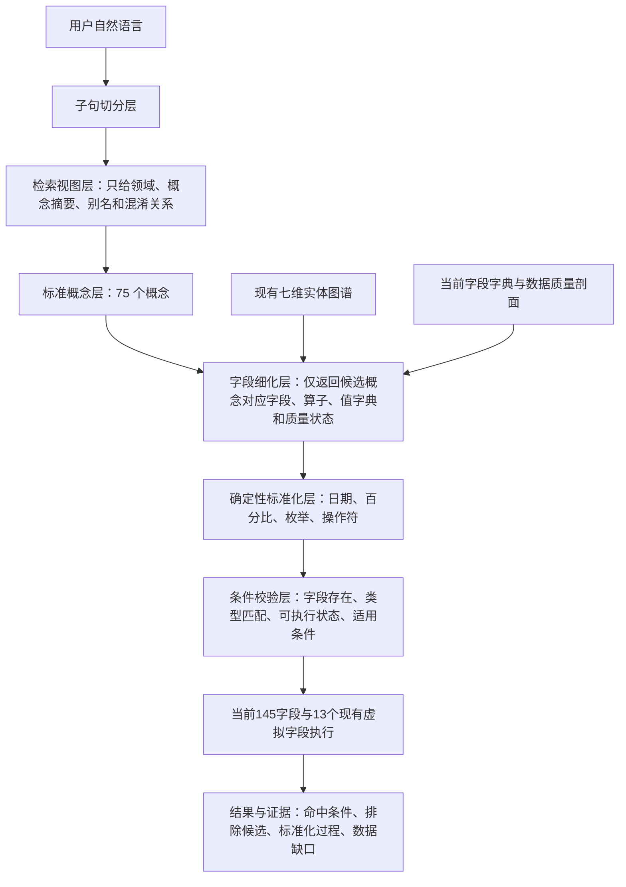

# AI选策略语义图谱、数据图谱 Schema 与字段映射提案

## 1. 本提案的状态与边界

- 状态：`proposal`，供确认，尚未接入 AI 选策略解析器、页面数据包或生产 DAG。
- 数据快照：`strategy_list_pack.js.gz`，生成时间 2026-08-07 03:41，1,305 条策略。
- 物理字段：145 个，全部一一映射；不增加、不改名、不删除现有字段。
- 运行时虚拟字段：13 个，只登记 `ai-strategy.js` 已存在的能力。
- 明确排除：`首次建仓日`、`建仓日期`。它们只是讨论示例，不是当前数据字段，也不登记为标准概念。
- 机器可读 Schema：`程序代码/config/AI选策略语义数据图谱Schema.json`。
- 机器可读映射：`程序代码/config/AI选策略145字段标准概念映射.json`。

本轮只建立可确认的标准，不改变页面筛选行为。确认后再单独实施图谱生成器、分阶段模型调用、确定性标准化器和回归测试。

## 2. 当前数据剖面

| 指标 | 当前值 | 设计影响 |
| --- | ---: | --- |
| 策略行数 | 1,305 | 值字典和覆盖率应从当前数据包生成 |
| 物理字段 | 145 | 映射清单必须恰好覆盖 145 个唯一字段 |
| 已有字段说明 | 112（77.24%） | 可直接用于第二阶段字段细化 |
| 缺字段说明 | 33（22.76%） | 不应把缺说明字段无差别发给弱模型 |
| 全字段平均非空率 | 85.07% | 总体可用，但不能掩盖局部空字段 |
| 字段覆盖率中位数 | 93.79% | 高频主属性适合进入概念召回层 |
| 100% 覆盖字段 | 61 | 可作为稳定主字段 |
| 90% 至不足 100% | 32 | 可直接筛选，需保留缺失处理 |
| 50% 至不足 90% | 36 | 可筛选，但返回结果需披露覆盖边界 |
| 20% 至不足 50% | 0 | 当前不存在这个断层 |
| 5% 至不足 20% | 3 | 只在明确语义和适用条件下召回 |
| 大于 0% 至不足 5% | 9 | 默认不进入首轮模型候选 |
| 全空字段 | 4 | 保留结构，禁止生成筛选条件 |

全空字段为：`母策略ID`、`母策略名称`、`策略关系类型`、`官方业绩来源策略ID`。

缺说明的 33 个字段已在机器可读映射的 `datasetProfile.dictionaryMissingFields` 中完整列出。映射通过 `dictionaryDocumented=false` 暴露缺口，不用猜测描述填充生产字典。

## 3. 图谱分层设计



### 3.1 领域层

当前划分 13 个领域：治理与展示、身份与来源、生命周期、分类标签、收益业绩、风险指标、持仓与资产暴露、调仓行为、信号行为、业绩基准、费率、数据质量、技术字段。

领域层只用于粗召回，不直接生成筛选条件。弱模型第一轮看到的是短描述和典型语义，不是 145 个字段的全部细节。

### 3.2 标准概念层

75 个标准概念是语义稳定层。多个物理字段可以通过 `dimensions` 挂在同一概念下，例如：

- `performance.period_return` 通过 `horizon=1w/1m/3m/6m/1y/ytd` 连接六个区间收益字段。
- `benchmark.exposure` 通过 `taxonomy` 和 `assetClass` 连接 19 个基准暴露字段。
- `signal.instruction_count` 通过 `instruction=all/buy/sell/increase/decrease` 连接五个指令数字段。
- `strategy.governance.flag` 连接九个现有治理布尔字段，但每个字段仍保留明确的 `flag` 维度。

标准概念不是新建数据列。它只负责把自然语言稳定地路由到现有字段。

### 3.3 物理字段层

每个物理字段至少包含：

- `conceptId`：归属的标准概念。
- `fieldType`：日期、百分比、枚举、布尔、文本等。
- `semanticRole`：主字段、变体、来源变体、证据、质量门禁、兼容同值字段或技术字段。
- `semanticVisibility`：直接筛选、高级筛选、条件式、仅证据或仅审计。
- `executionStatus`：可执行、条件可执行、仅证据、仅审计或无数据禁用。
- `dimensions`：期限、资产类别、来源、风险口径等交叉维度。

因此“属性识别可以宽一点”，但“最终执行必须窄且确定”：第一轮可召回多个概念，第二轮必须选定一个可执行主字段，并记录排除其他候选的原因。

### 3.4 现有实体图谱绑定

不另造一套持仓实体知识库，而是绑定当前 `ai_semantic_index` 的七个维度：

- `asset_class`
- `market_region`
- `standard_industry`
- `investment_theme`
- `index_underlying`
- `style_factor`
- `product_strategy`

持仓语义使用实体图谱的策略权重与证据链；业绩基准文本可以借用 `index_underlying` 的别名做标准化，但最终条件仍在 `业绩基准` 字段执行，不能把“基准包含沪深300”误作“实际持仓包含沪深300”。

## 4. 渐进式普通模型交互协议

### 第 1 次调用：子句切分

只要求模型输出原句的原子子句和逻辑关系，不提供字段表，也不允许生成字段、算子或值。

示例输入：

> 找最近3个月新成立、业绩基准包含沪深300、最大回撤不超过5%的策略

期望输出：

```json
{
  "logic": "and",
  "clauses": [
    {"id": "c1", "text": "最近3个月新成立"},
    {"id": "c2", "text": "业绩基准包含沪深300"},
    {"id": "c3", "text": "最大回撤不超过5%"}
  ]
}
```

### 第 2 次调用：概念宽召回

每个子句并发处理。只发送相关检索视图中的概念摘要、别名、正向提示、负向提示和易混淆概念，不发送 145 个字段全文。

预期候选排序：

- `c1`：`strategy.lifecycle.established_date` 第一；`strategy.lifecycle.operating_days`、`performance.date`、`holding.latest_date` 等只作为低分易混淆候选。
- `c2`：`benchmark.description` 第一；`holding.entity_match`、`benchmark.exposure` 作为易混淆候选。
- `c3`：`risk.max_drawdown` 第一；`risk.current_drawdown` 作为易混淆候选。

### 第 3 次调用：候选字段细化

只把入围概念对应的真实字段、详细说明、值类型、允许操作符、当前值字典、质量状态和易混淆字段发给模型。模型只能从给定选项中选择，不能自由书写字段名或操作符。

这一步的目标结果是：

```json
{
  "conditions": [
    {"clauseId":"c1","conceptId":"strategy.lifecycle.established_date","field":"成立日期","operator":"after","rawValue":"最近3个月"},
    {"clauseId":"c2","conceptId":"benchmark.description","field":"业绩基准","operator":"contains","rawValue":"沪深300"},
    {"clauseId":"c3","conceptId":"risk.max_drawdown","field":"最大回撤","operator":"lte","rawValue":"5%"}
  ]
}
```

### 第 4 步：程序确定性标准化，不再让模型计算

假设查询基准日为 2026-08-07：

- `最近3个月` 按日历月回退为 `2026-05-07`。
- `新成立` 结合成立日期固定生成 `成立日期 >= 2026-05-07`。
- `不超过5%` 固定生成 `最大回撤 <= 5`，单位为百分点。
- `沪深300` 可用现有实体别名标准化，但执行字段仍是 `业绩基准 contains 沪深300`。

最终条件：

```json
{
  "logic": "and",
  "queryAnchorDate": "2026-08-07",
  "conditions": [
    {"field":"成立日期","operator":"gte","value":"2026-05-07","valueType":"date"},
    {"field":"业绩基准","operator":"contains","value":"沪深300","valueType":"text"},
    {"field":"最大回撤","operator":"lte","value":5,"valueType":"percent"}
  ]
}
```

### 第 5 步：校验与可解释结果

执行前必须校验：字段是否真实存在、字段是否可执行、操作符是否属于该类型、标准值是否合规、条件是否满足适用范围。返回结果同时保留：

- 原始子句；
- 候选概念及分数；
- 最终字段选择；
- 被排除的易混淆字段及原因；
- 日期和数值标准化轨迹；
- 字段缺值或覆盖率限制。

## 5. 145 个物理字段到标准概念的完整分组清单

下表逐项覆盖全部 145 个字段。精确到每个字段的类型、维度、角色、可见性、执行状态和字段说明状态，以机器可读映射文件为准。

| 标准概念 ID | 标准概念 | 当前物理字段 | 字段数 |
| --- | --- | --- | ---: |
| `strategy.governance.status` | 策略治理状态 | 策略治理状态 | 1 |
| `strategy.governance.analysis_group` | 分析分组 | 分析分组 | 1 |
| `strategy.governance.flag` | 治理布尔标记 | 是否测试组合、是否信号类组合、是否目标盈期次、是否已停止、是否历史接口留档、是否纳入常规排名、仅列表展示、是否单独分析、是否多元策略 | 9 |
| `strategy.relationship` | 策略关系 | 母策略ID、母策略名称、策略关系类型 | 3 |
| `strategy.governance.rule` | 治理规则说明 | 治理规则说明 | 1 |
| `strategy.governance.evidence` | 分类与展示依据 | 业务分类依据、天天展示判定依据、分类依据、风险分类依据、研报分类依据 | 5 |
| `strategy.governance.display` | 展示状态 | 天天当前对客展示、天天展示状态 | 2 |
| `strategy.governance.insight_scope` | 洞察评价对象 | 洞察评价对象 | 1 |
| `strategy.id` | 统一策略ID | 统一策略ID | 1 |
| `strategy.code` | 策略代码 | 策略代码 | 1 |
| `strategy.name` | 策略名称 | 策略名称 | 1 |
| `strategy.channel` | 渠道 | 渠道 | 1 |
| `strategy.advisor` | 投顾机构 | 投顾机构 | 1 |
| `strategy.classification.type` | 策略类型 | 披露策略类型 | 1 |
| `strategy.classification.disclosed_risk` | 披露风险等级 | 披露风险等级 | 1 |
| `strategy.classification.research` | 研报分类 | 研报产品类型、研报股票子类型 | 2 |
| `strategy.classification.business` | 业务分类 | 业务分类、业务组合分类 | 2 |
| `strategy.classification.region` | 市场地域 | 市场地域 | 1 |
| `strategy.classification.management_style` | 主动被动 | 主动被动 | 1 |
| `strategy.classification.tags` | 策略标签 | 特殊标签、策略实现标签、多元策略标签 | 3 |
| `strategy.lifecycle.established_date` | 成立日期 | 成立日期 | 1 |
| `strategy.lifecycle.status` | 运作状态 | 运作状态 | 1 |
| `strategy.lifecycle.operating_days` | 运作天数 | 运作天数 | 1 |
| `data.completeness` | 数据完整性 | 数据完整性、质检情况 | 2 |
| `data.foundation_level` | 基础数据等级 | 基础数据等级 | 1 |
| `performance.source_strategy_id` | 官方业绩来源策略ID | 官方业绩来源策略ID | 1 |
| `performance.official_policy` | 官方业绩口径 | 官方业绩口径 | 1 |
| `performance.date` | 业绩日期 | 业绩分析截止日期、最新业绩日期、收益数据截至 | 3 |
| `performance.period_return` | 区间收益 | 近一周、近一月、近三月、近6月、近1年、今年以来 | 6 |
| `performance.cumulative_return` | 累计收益率 | 累计收益率 | 1 |
| `performance.nav` | 官方单位净值 | 官方单位净值 | 1 |
| `performance.cumulative_return_source` | 分来源累计收益 | 官方累计收益、自建累计收益 | 2 |
| `performance.source_deviation` | 官方偏差 | 与官方偏差 | 1 |
| `performance.annualized_return` | 年化收益 | 年化收益 | 1 |
| `performance.daily_return` | 日涨跌幅 | 日涨跌幅 | 1 |
| `risk.max_drawdown` | 最大回撤 | 最大回撤 | 1 |
| `risk.current_drawdown` | 当前回撤 | 当前回撤 | 1 |
| `risk.volatility` | 波动率 | 波动率 | 1 |
| `risk.sharpe` | 夏普比率 | 夏普比率 | 1 |
| `risk.level` | 风险等级与风险档 | 风险等级、权益风险档、波动风险档、回撤风险档 | 4 |
| `risk.date` | 风险数据截至 | 风险数据截至 | 1 |
| `risk.source` | 风险来源 | 风险来源 | 1 |
| `risk.trigger` | 风险触发指标 | 风险触发指标 | 1 |
| `holding.processing_policy` | 持仓处理方式 | 持仓处理方式 | 1 |
| `holding.asset_weight` | 持仓资产权重 | 权益基金权重、债券基金权重、货币基金权重、混合基金权重、QDII权重、指数基金权重、主动基金权重 | 7 |
| `holding.latest_date` | 最新持仓日 | 最新持仓日 | 1 |
| `holding.fund_count` | 持仓基金数 | 持仓基金数 | 1 |
| `rebalance.display_policy` | 调仓展示方式 | 调仓展示方式 | 1 |
| `rebalance.latest_date` | 最近调仓日 | 最近调仓日 | 1 |
| `rebalance.count` | 调仓次数 | 调仓次数、最近一年调仓次数 | 2 |
| `rebalance.turnover` | 换手率 | 单次平均换手率、年化换手率 | 2 |
| `rebalance.frequency` | 调仓频率 | 调仓频率 | 1 |
| `signal.event_count` | 信号事件数 | 信号事件数 | 1 |
| `signal.latest_date` | 最近信号日 | 最近信号日 | 1 |
| `signal.instruction_count` | 信号指令数 | 信号指令数、买入指令数、卖出指令数、加仓指令数、减仓指令数 | 5 |
| `signal.win_rate` | 信号胜率 | 信号胜率_1月、信号胜率_3月、信号胜率_6月、信号胜率_1年 | 4 |
| `signal.direction_return` | 信号加权方向收益 | 信号加权方向收益_1月、信号加权方向收益_3月、信号加权方向收益_6月、信号加权方向收益_1年 | 4 |
| `benchmark.description` | 业绩基准文本 | 业绩基准说明、业绩基准 | 2 |
| `benchmark.status` | 基准可用状态 | 基准可用状态 | 1 |
| `benchmark.exposure` | 基准资产暴露 | 基准权益权重、基准债券权重、基准货币权重、广义权益权重、基准港股权益权重、基准海外权益权重、基准资产大类-权益、基准资产大类-债券、基准资产大类-现金、基准资产大类-商品、基准资产大类-另类、基准资产大类-其他、基准资产类别-A股、基准资产类别-港股、基准资产类别-海外权益、基准资产类别-债券、基准资产类别-商品、基准资产类别-现金、基准资产类别-其他 | 19 |
| `benchmark.bucket` | 基准权益分档 | 基准权益分档、基准权益分类档、广义权益分档 | 3 |
| `benchmark.bucket_description` | 广义权益分档说明 | 广义权益分档说明 | 1 |
| `benchmark.structure` | 基准结构类型 | 基准结构类型 | 1 |
| `benchmark.peer_pool` | 可比池 | 非权益比较轨道、正式可比池、可比池样本资格、可比池说明 | 4 |
| `benchmark.mapping_quality` | 基准映射质量 | 基准互斥权重合计_百分比、基准映射置信度、基准资产已映射权重、基准资产未映射权重 | 4 |
| `fee.status` | 费率状态 | 费率状态 | 1 |
| `fee.advisory_rate` | 年化投顾费率 | 年化投顾费率 | 1 |
| `technical.detail_path` | 详情文件路径 | detailFile | 1 |
| `technical.search_text` | 搜索聚合文本 | searchText | 1 |

表中字段数合计为 145。

## 6. 13 个现有虚拟字段映射

| 现有虚拟字段 | 标准概念 | 用途 | 默认执行策略 |
| --- | --- | --- | --- |
| `__benchmark_text` | `benchmark.description` | 合并业绩基准相关文本 | 可执行 |
| `__holding_entity` | `holding.entity_match` | 汇总策略持仓实体 | 可执行 |
| `__source_any` | `virtual.source_text` | 机构、渠道、策略名称综合匹配 | 高级筛选 |
| `__gf_any` | `virtual.source_text` | 广发相关综合命中 | 高级筛选 |
| `__any_text` | `virtual.any_text` | 全字段召回兜底 | 仅审计，不替代结构化条件 |
| `风险等级序号` | `risk.level_order` | 风险等级可比较顺序 | 高级筛选 |
| `持仓实体判断` | `holding.entity_match` | 是否持有目标实体 | 可执行 |
| `持仓实体权重` | `holding.entity_match` | 目标实体聚合权重 | 可执行 |
| `持仓实体证据` | `holding.entity_match` | 命中的基金和分类证据 | 仅证据 |
| `海外资产判断` | `holding.overseas_exposure` | 是否包含海外资产 | 可执行 |
| `海外资产权重` | `holding.overseas_exposure` | 海外资产聚合权重 | 可执行 |
| `海外资产分类` | `holding.overseas_exposure` | 海外资产标准分类 | 高级筛选 |
| `黄金判断` | `holding.gold_exposure` | 是否包含黄金资产 | 可执行 |

## 7. 同值、过细和低质量字段的处理原则

当前不物理合并字段，先在语义层收敛：

- `业绩分析截止日期`、`最新业绩日期`、`收益数据截至`：归入 `performance.date`，默认执行 `最新业绩日期`，其余保留来源和证据角色。
- `累计收益率`、`官方累计收益`：保留不同血缘；普通“累计收益”默认执行 `累计收益率`。
- `业绩基准说明`、`业绩基准`：普通文本条件默认执行 `业绩基准`，说明字段保留证据角色。
- `基准权益分档`、`基准权益分类档`：默认执行 `基准权益分档`，后者暂作兼容同值字段。
- 基准大类权重和资产类别权重：不合并为同一列，通过 `taxonomy=major/subclass/core/region/broad` 保留不同粒度。
- 四个全空字段：保留真实数据结构，标为 `inactive_no_data`，不进入普通模型候选。

这比直接删字段更安全：既减少模型歧义，又不破坏现有页面、数据血缘和下游兼容性。

## 8. 需要确认的设计点

1. 是否认可“13 个领域、75 个标准概念、145 个物理字段、13 个现有虚拟字段”的总体粒度。
2. 是否认可同值字段的默认主字段：`最新业绩日期`、`累计收益率`、`业绩基准`、`基准权益分档`。
3. 是否认可 `evidence_only` 和 `audit_only` 字段不生成普通筛选条件，只在解释和排错阶段返回。
4. 是否认可相对月按查询基准日回退日历月并包含边界，例如 2026-08-07 的“最近3个月新成立”固定为 `成立日期 >= 2026-05-07`。
5. 确认后下一步是否先补齐 33 个缺字段说明，再实现两阶段概念召回和条件细化；建议先补字段说明，否则第二阶段仍会在这些属性上缺少可靠口径。

## 9. 本轮项目数据稽核结果

按项目规范启动了完整 hook；完整构建阶段生成标准报告后，外层汇总因工具超时中断，因此又执行了 `--audit-only` 复核。复核因数据错误以非零状态结束，最新标准化稽核状态为 `error`：4 个 error、9 个 warn。

最新报告：`程序代码/outputs/data_audit/2026-08-07/20260807T164808+0800/data_audit_report.json`

完整 hook 在外层超时前已重建本地正式报告目录中的部分 `basic_data` 文件，`basic_summary_core.js` 时间为 16:45；但 `结果文件/全市场投顾分析平台/deployment_manifest.json` 仍是 11:28，`结果文件/最小发布集/deployment_manifest.json` 仍是 11:26。本轮没有发布，也没有把失败稽核后的正式清单改写为 `ready`。因此该本地正式报告目录目前不是已完成、可发布的闭环状态；后续必须先修复 4 个 error，再完整重建、稽核并生成一致清单。

### 9.1 与本图谱直接相关的问题

| 问题 | 数据范围 | 根因 | 对语义筛选的影响 | 本提案处理 |
| --- | --- | --- | --- | --- |
| 母策略共享业绩详情缺失 | 已确认共享母策略业绩的子策略详情包 | 数据库有关系事实，页面未携带关系、曲线或非独立净值说明 | 若启用母策略或来源策略筛选，会把空页面字段当成真实无关系 | 四个当前全空字段保持 `inactive_no_data`，不进入模型候选 |
| 共享基准口径未同步 | 共享官方业绩的子策略 | 页面仍读取子策略空基准字段 | 可能把已有母策略基准的子策略误判为无基准 | 现阶段只按当前 `业绩基准` 执行，不推断继承关系 |
| 页面核心字段缺失 | `basic_summary_core.js` 的 145 字段策略对象 | 字段规则要求 `业绩基准来源策略ID`、`业绩基准继承口径`，当前页面包未生成 | 基准来源和继承方式不可追溯 | 它们不属于当前 145 字段，本轮不擅自加入；应先修复页面构建链，再升级 Schema 版本 |
| 关键字段非空率不足 | 数据库 `策略信息` | 渠道未披露、采集缺口或加工未同步 | `风险等级`、`成立日期`、`业绩基准` 条件会排除缺值策略，命中率不能解释为全市场覆盖 | 第二阶段必须返回字段覆盖和缺失处理，不静默视为不满足 |

数据库关键字段当前非空率：`风险等级` 87.01%（规则要求 98%）、`成立日期` 84.48%（规则要求 97%）、`业绩基准` 75.39%（规则要求 90%）。

### 9.2 其他项目级问题

- 1 只在运作策略的最新直接持仓存在空权重或权重合计低于 50%。
- 7 条公募基金基准已披露但无法确定权益分档。
- 基金详情经济暴露包未与权威快照同步，此项为 error。
- 5 条正权重当前持仓缺至少一个区间同类排名。
- 62 只基金不足两个可用净值点，详情页不能绘制真实走势图。
- 208 只 FOF 因成立日期未披露或未解析，无法判断是否属于正常短历史。
- 天天官方基准曲线存在允许范围内的一工作日延迟。
- 贝塔牛日度业绩及真实官方曲线覆盖不足，真实曲线仅 0/31。

这些问题不是本次新增 Schema 和映射造成的，也没有在本轮越界修复。它们说明图谱执行层必须把 `quality_status` 一并送入第二阶段，并在结果解释中披露缺失范围。
